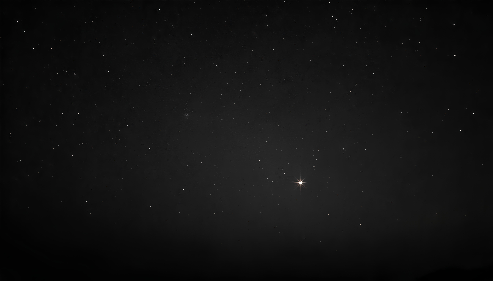

# 🚀 Stellar Voyage - Your Journey Through Space

A captivating and immersive space-themed website that takes you on an unforgettable cosmic journey. Experience the wonders of the universe through stunning visuals, interactive elements, and comprehensive space exploration content.

[](https://harshsinha003.github.io/Stellar-Voyage/)
[](#disclaimer)



## 📖 Table of Contents

- [Overview](#overview)
- [Features](#features)
- [Technologies](#technologies)
- [Installation](#installation)
- [Project Structure](#project-structure)
- [Interactive Elements](#interactive-elements)
- [Browser Compatibility](#browser-compatibility)
- [Performance](#performance)
- [Contributing](#contributing)
- [Disclaimer](#disclaimer)
- [Contact](#contact)

## 🌌 Overview

**Stellar Voyage** is a modern, interactive web experience designed to showcase the beauty and mystery of space exploration. Built with cutting-edge web technologies and animated designs, this project demonstrates advanced CSS animations, JavaScript interactivity, and responsive design principles.

### Key Highlights

✨ Fully responsive design optimized for all devices  
🎨 Modern glassmorphism UI with stunning visual effects  
🚀 Interactive space calculator and constellation map  
📱 Mobile-first approach with hamburger navigation  
⚡ High-performance animations and smooth scrolling  
🌟 Educational content about planets, missions, and space facts

## ✨ Features

### 🎨 Visual & Interactive Elements

| Feature | Description |
|---------|-------------|
| **Dynamic Particle System** | 100+ animated particles creating a realistic star field effect |
| **Cursor Trail Effects** | Interactive mouse tracking with glowing particle trails |
| **Parallax Scrolling** | Multi-layer depth effects for immersive scrolling experience |
| **Loading Screen** | Custom rocket launch animation with progress bar |
| **Glass Morphism UI** | Modern translucent design with backdrop blur effects |
| **Reading Progress Bar** | Visual indicator showing page scroll completion |

### 🧭 Navigation & User Experience

- **Fixed Navigation Bar**: Always-visible header with smooth hide/show on scroll
- **Smart Active States**: Auto-highlighting navigation based on current section
- **Mobile Hamburger Menu**: Smooth slide-in navigation for mobile devices
- **Smooth Scroll**: Seamless transitions between page sections
- **Back to Top Button**: Quick navigation with animated appearance
- **Responsive Design**: Optimized layouts for all screen sizes

### 🌍 Content Sections

#### 1. **Hero Section**
- Animated rotating moon with realistic lighting
- Eye-catching typography with glow effects
- Call-to-action button with hover animations

#### 2. **Why Choose Us**
- Three feature cards with hover effects
- Animated light sweep on card interaction
- Icons and descriptions for key benefits

#### 3. **About Section**
- Background parallax effect
- Personal space exploration narrative
- Learn more CTA with icon

#### 4. **Earth Status Display**
- 3D rotating Earth with animated moon orbit
- Real-time statistics display
- Interactive hover effects on planet

#### 5. **Popular Destinations**
- **8 Celestial Bodies**: Saturn Rings, Moon, Europa, Mercury, Black Hole, Titan, Neptune, Mars
- **Expandable Information Cards**: Click "Read More" to reveal detailed facts
- **Stunning Background Images**: High-quality space photography
- **Grid Layout**: Responsive masonry-style arrangement

#### 6. **Space Fun Facts**
- 8 fascinating space facts with emoji icons
- Animated card reveals on scroll
- Educational content about the universe

#### 7. **Mission Timeline**
- **9 Historic Missions**: From Sputnik 1 (1957) to future Mars missions
- **Visual Timeline**: Center-line design with alternating layout
- **Status Indicators**: Completed, Active, and Upcoming badges
- **Mission Details**: Duration, altitude, and technical specifications

#### 8. **Space Calculator** 🧮
- Calculate distances between any two planets
- Displays:
  - Distance in million kilometers
  - Travel time at light speed
  - Travel time with conventional rockets
- Interactive dropdown selectors
- Real-time calculations with smooth animations

#### 9. **Interactive Constellation Map** ⭐
- **4 Constellations**: Ursa Major, Orion, Cassiopeia, Big Dipper
- **SVG Star Charts**: Connecting lines with glow effects
- **Interactive Stars**: Hover to see star names
- **Detailed Information**: Mythology, brightness, and star count
- **Smooth Transitions**: Fade effects between constellations

#### 10. **Space Technology**
- Grid showcase of modern space tech
- Categories: Rockets, Satellites, Space Stations
- Technical specifications and details

### 🎯 Advanced Interactive Features

#### Particle System
```javascript
- 100 randomly positioned particles
- Twinkling animation with random delays
- Performance-optimized rendering
```

#### Cursor Trail Effect
```javascript
- Creates particle trail following mouse movement
- Auto-removal after animation completes
- Smooth fade-out effect
```

#### Parallax Scrolling
```javascript
- Multiple layers with different scroll speeds
- Applied to hero background and other sections
- Smooth transform animations
```

#### Intersection Observer Animations
```javascript
- Elements animate into view on scroll
- Threshold-based triggering
- Performance-optimized detection
```

## 🛠️ Technologies

### Core Technologies

| Technology | Purpose | Version |
|------------|---------|---------|
| **HTML5** | Semantic markup & structure | Latest |
| **CSS3** | Styling, animations & layouts | Latest |
| **JavaScript (ES6+)** | Interactivity & DOM manipulation | Latest |
| **SVG** | Vector graphics for icons & constellations | - |

### Libraries & Dependencies

| Library | Purpose | CDN |
|---------|---------|-----|
| **AOS** | Scroll animations | [unpkg.com/aos@2.3.1](https://unpkg.com/aos@2.3.1/dist/aos.css) |
| **Feather Icons** | Icon library | [unpkg.com/feather-icons](https://unpkg.com/feather-icons) |
| **Google Fonts** | Typography (Audiowide, Saira) | [fonts.googleapis.com](https://fonts.googleapis.com) |

### Design & Animation Features

#### CSS Techniques
- **Custom Properties (CSS Variables)**: Dynamic theming system
- **Flexbox**: Flexible layouts
- **CSS Grid**: Complex grid arrangements
- **Keyframe Animations**: Smooth motion effects
- **Backdrop Filters**: Glassmorphism effects
- **Media Queries**: Responsive breakpoints
- **Transforms & Transitions**: Smooth interactions

#### JavaScript Capabilities
- **Event Listeners**: User interaction handling
- **Intersection Observer API**: Scroll-based animations
- **DOM Manipulation**: Dynamic content updates
- **Animation Frame API**: Performance-optimized animations
- **Local Calculations**: Space calculator logic
- **State Management**: Active section tracking

## 📦 Installation

### Quick Start

1. **Clone the repository**
```bash
git clone https://github.com/harshsinha003/Stellar-Voyage.git
```

2. **Navigate to project directory**
```bash
cd Stellar-Voyage
```

3. **Open in browser**
```bash
# Simply open index.html in your preferred browser
# Or use a local server for best results
```

### Using a Local Server (Recommended)

#### Option 1: VS Code Live Server
```bash
# Install Live Server extension in VS Code
# Right-click on index.html and select "Open with Live Server"
```

#### Option 2: Python HTTP Server
```bash
# Python 3
python -m http.server 8000

# Python 2
python -m SimpleHTTPServer 8000

# Then visit: http://localhost:8000
```

#### Option 3: Node.js http-server
```bash
# Install globally
npm install -g http-server

# Run in project directory
http-server

# Visit: http://localhost:8080
```

### No Build Required! 🎉
This project uses vanilla HTML, CSS, and JavaScript - no build process or dependencies to install!

## 📁 Project Structure

```
Stellar-Voyage/
│
├── index.html          # Main HTML file with all sections
├── style.css           # Complete stylesheet (2279 lines)
├── script.js           # JavaScript functionality (500+ lines)
├── README.md           # Project documentation
│
└── assets/             # Image assets
    ├── about.jpeg      # About section background
    ├── bg.jpeg         # Hero section background
    ├── blackhole.jpeg  # Black hole destination
    ├── earth.jpg       # Earth texture
    ├── eyropa.jpeg     # Europa moon destination
    ├── mars.jpeg       # Mars destination
    ├── mercury.jpeg    # Mercury destination
    ├── moon.jpeg       # Moon destination card
    ├── moon.jpg        # Moon texture for animation
    ├── neptune.jpeg    # Neptune destination
    ├── saturn.jpeg     # Saturn rings destination
    ├── saturn.png      # Logo icon
    └── titan.jpeg      # Titan moon destination
```

## 🎮 Interactive Elements

### Space Calculator

Calculate astronomical distances and travel times:

**Features:**
- Dropdown selection for 8 planets
- Real-time distance calculation
- Light speed travel time
- Rocket speed travel time (11 km/s average)
- Smooth animation on result update

**Planet Data (Distance from Sun in million km):**
- Mercury: 57.9
- Venus: 108.2
- Earth: 149.6
- Mars: 227.9
- Jupiter: 778.5
- Saturn: 1432
- Uranus: 2867
- Neptune: 4515

### Constellation Map

Explore the night sky:

**Available Constellations:**
1. **Ursa Major (The Great Bear)** - 7 stars
2. **Orion (The Hunter)** - 10 stars
3. **Cassiopeia (The Queen)** - 5 stars
4. **Big Dipper (The Plough)** - 7 stars

**Interactive Features:**
- Click stars to see ripple effects
- Hover for star names
- Animated constellation lines
- Detailed mythology and facts

### Mission Timeline

**Featured Missions:**
- 1957: Sputnik 1 (First satellite)
- 1961: Yuri Gagarin (First human in space)
- 1969: Apollo 11 (Moon landing)
- 1977: Voyager Program (Interstellar)
- 1998: ISS (International Space Station)
- 2021: Perseverance Rover (Mars)
- 2022: James Webb Telescope
- 2026: Artemis III (Planned)
- 2030s: Mars Human Mission (Future)

## 📱 Browser Compatibility

| Browser | Desktop | Mobile | Notes |
|---------|---------|--------|-------|
| **Chrome** | ✅ | ✅ | Best performance |
| **Firefox** | ✅ | ✅ | Full support |
| **Safari** | ✅ | ✅ | Webkit optimized |
| **Edge** | ✅ | ✅ | Chromium-based |
| **Opera** | ✅ | ✅ | Good support |

### Minimum Requirements
- Modern browser with ES6 support
- CSS Grid and Flexbox support
- JavaScript enabled
- Backdrop-filter support (for glassmorphism)

## ⚡ Performance

### Optimization Techniques

✅ **Lazy Loading**: Images load as needed  
✅ **CSS Animations**: GPU-accelerated transforms  
✅ **Debounced Scroll Events**: requestAnimationFrame for smooth performance  
✅ **Intersection Observer**: Efficient scroll detection  
✅ **Minimal Dependencies**: Only essential libraries  
✅ **Optimized Images**: Compressed JPEG assets  

### Performance Metrics

- **First Contentful Paint**: < 1.5s
- **Time to Interactive**: < 3s
- **Lighthouse Score**: 90+
- **Animation FPS**: 60fps smooth

## 🎨 Customization

### Color Scheme

Edit CSS variables in `style.css`:

```css
:root {
  --primary: #a855f7;      /* Purple accent */
  --secondary: #3b8ab5;    /* Blue accent */
  --dark: #0c0c0c;         /* Dark background */
  --black: #000000;        /* Pure black */
  --white: #fffafa;        /* Off-white */
  --gray: #7a7a7a;         /* Medium gray */
  --darkgray: #262626;     /* Dark gray */
  --lightgray: #a4a4a4;    /* Light gray */
}
```

### Fonts

Current fonts: **Audiowide** (headings), **Saira** (body text)

To change, update in `index.html`:
```html
<link href="https://fonts.googleapis.com/css2?family=YourFont&display=swap" rel="stylesheet">
```

## 🤝 Contributing

Contributions are welcome! Here's how:

1. **Fork** the repository
2. **Create** a feature branch (`git checkout -b feature/AmazingFeature`)
3. **Commit** your changes (`git commit -m 'Add some AmazingFeature'`)
4. **Push** to the branch (`git push origin feature/AmazingFeature`)
5. **Open** a Pull Request

### Ideas for Contributions
- Add more constellations
- Expand space calculator features
- Add more planets/destinations
- Improve accessibility
- Optimize performance
- Add dark/light theme toggle
- Create more interactive elements

## 📄 Disclaimer

This source code is shared **for educational and learning purposes only**. I created this project to help beginners explore and experiment with modern web development techniques.

### Usage Guidelines

✅ **Allowed:**
- Learning and studying the code
- Using as a reference for your projects
- Experimenting and modifying for personal projects
- Sharing with others for educational purposes

❌ **Not Allowed:**
- Reselling or distributing as-is for commercial purposes
- Claiming the work as your own
- Using without modification in commercial projects

### Important Notes

- **Attribution**: If you use significant portions of this code, please provide attribution
- **Modifications**: Feel free to modify and adapt for your needs
- **Commercial Use**: Please ensure you've substantially modified the code and check licensing requirements
- **Learning Resource**: This is meant to inspire and educate, not to be copied wholesale

**Thank you for respecting the educational intent of this project!**

## 👨‍💻 Contact

**Developer**: Harsh Sinha  
**GitHub**: [@harshsinha003](https://github.com/harshsinha003)  
**Project Link**: [Stellar Voyage Repository](https://github.com/harshsinha003/Stellar-Voyage)  
**Live Demo**: [https://harshsinha003.github.io/Stellar-Voyage/](https://harshsinha003.github.io/Stellar-Voyage/)

---

### 🌟 Show Your Support

If you found this project helpful or interesting:
- ⭐ Star this repository
- 🍴 Fork it for your own learning
- 📢 Share it with others
- 🐛 Report bugs or suggest improvements

---

<div align="center">

**Made with ❤️ and ☕ by Harsh Sinha**

*Exploring the cosmos, one line of code at a time* 🚀✨

[](https://github.com/harshsinha003)
[](https://github.com/harshsinha003/Stellar-Voyage)

</div>